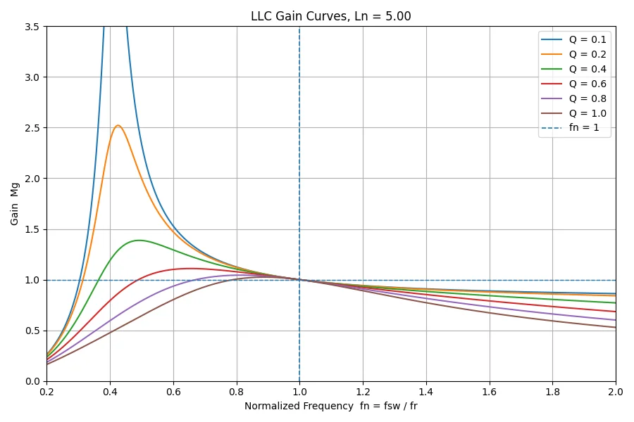
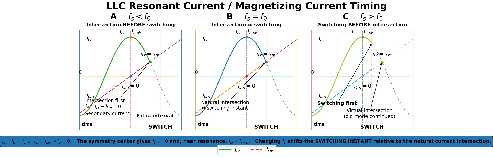
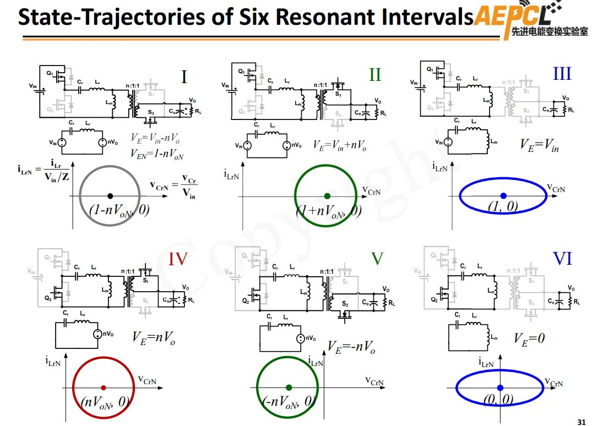

# LLC相关概念扫盲：

[TOC]

## 1. 基础概念

### 1.1 励磁电感

励磁电感：$L_m$ 变压器即使副边开路，原边加交流电压后仍然会有一个电流，电流用于建立磁芯中的交变磁通，叫做励磁电流$i_m$,从电路端口看，这种建立磁场的作用可以等效为一个电感。

### 1.2 实际变压器:

实际变压器可以粗略理解为

$$
理想变压器 + L_m +L_{lk}
$$

其中

$$
L_m=励磁电感 \\
L_{lk}=漏感
$$

### 1.3 谐振与品质系数

谐振腔分别有串联谐振和并联谐振，是电感相对于等效负载电阻是串联还是并联来说的。

通用的器件的品质系数Q是储能除以损耗，但是对于LLC来说是

$$
Q_{LLC} = \frac{Z_r}{R_{AC}} =\frac{谐振腔特征阻抗}{等效负载电阻}
$$

## 2. 谐振拓扑与负载影响

对于各种等效的拓扑可以简单理解为无源滤波器来分辨

> [补充各种谐振拓扑图片和响应图片]

常见的使用的是谐振电感和谐振电容串联然后接入变压器，负载并联接入励磁电感

是常见的带通滤波器的响应曲线，

负载越重，等效负载电阻越小，其通频带越宽，谐振增益越小，

反之负载越轻，等效负载电阻越大，其通频带约窄，谐振增益越高

😒对于只含有$C_r$和$L_m$的并联谐振，在重载低阻的情况增益不会超过一，而对于轻载时达到单位增益会出现明显的谐振增益峰值

对于没有励磁电感的谐振变换器会出现增益不超过一的带通滤波器

### 对于简单的LC串联和并联

| 电路                 | 谐振条件               | 谐振频率                                        | 品质因数                                |
| -------------------- | ---------------------- | ----------------------------------------------- | --------------------------------------- |
| 串联 RLC             | $\operatorname{Im}Z=0$ | $\frac1{2\pi\sqrt{LC}}$                         | $\frac{\omega_0L}{R}=\frac1R\sqrt{L/C}$ |
| 并联 RLC             | $\operatorname{Im}Y=0$ | $\frac1{2\pi\sqrt{LC}}$                         | $\frac{R}{\omega_0L}=R\sqrt{C/L}$       |
| 实际 $r+L$ 与 C 并联 | $\operatorname{Im}Y=0$ | $\frac1{2\pi}\sqrt{\frac1{LC}-\frac{r^2}{L^2}}$ | $\approx\frac{\omega_rL}{r}$            |

## 3. FHA 增益模型

对于LLC使用的是谐振电容$C_R$串联谐振电感$L_R$的串联谐振部位然后串联励磁电感$L_M$和等效负载$R_{AC}$获得的幅值增益模型分析

### 3.1 归一化参数

这里有$f_N=\frac{f_{sw}}{f_R}$的归一化和$L_{N} = \frac{L_M}{L_R}$以及$Q=\frac{Z_0}{R_{AC}} = \frac{\sqrt{L_R/C_R}}{R_{AC}}$推导获得以下结论

### 3.2 传递函数与幅值增益

因此：

$$
\boxed{ H= \frac1{ \left( 1+\frac1{L_N} -\frac1{f_N^2L_N} \right) + jQ \left( f_N-\frac1{f_N} \right) } }
$$

这已经是非常实用的 LLC FHA 传递函数形式。

$$
\boxed{ M_G= \frac1{ \sqrt{ \left( 1+\frac1{L_N} -\frac1{f_N^2L_N} \right)^2 + Q^2 \left( f_N-\frac1{f_N} \right)^2 } } }
$$

这就是最适合实际计算的形式。

### 3.3 负载变化与增益曲线

可以把它记成：

$$
\boxed{ \text{轻载：励磁电流占比大，}L_m\text{特性明显} }
$$

$$
\boxed{ \text{重载：负载电流占比大，阻尼明显，}L_m\text{相对影响减弱} }
$$

这也正好解释了你 Python 图中的现象：**小 $Q$（轻载）曲线峰值高，大 $Q$（重载）曲线峰值被压低。**

## 4. 对于半桥谐振器和全桥谐振器的区别与优势和劣势

以下是两种对比图

全桥的母线利用率高，谐振腔电压有两倍的关系，半桥能够提供±0.5Vin电压，全桥能提供±Vin的电压

> 注意！全桥并不能实现对mos管耐压减半，还是输出电压的耐压，但是同样工况下会使得谐振电流减半，电流应力和热应力分散，适合高功率场景。

这样的双电容能够避免磁通单方向积累，对于双电容来说在交流谐振的情况下，GND和VCC为等效连接所以能谐振参数为两者并联（模电知识）

## 5. FHA 分析的适用性

对于LLC相关的谐振分析来说，常用的是**一阶谐波分析法**，即将输出的电压激励看作为简单的理想的对称的pwm方波，当频率偏移谐振频率时，准确性会越来越差。

## 6. 对于LLC来说的EMI分析来说比较有意思

**总结为高的电压变换率活激发共模EMI，高的电流变化率会激发差模EMI**

由于LLC的开关节点有接近正弦的电流波形，会有小的差模EMI，对于电压来说为方波，会有较多的谐波分量，会有较多的共模EMI

对于差模的EMI会影响的电源正负极两端的电压，直观表现为电源的纹波大，

对于共模的EMI会影响到整个系统一起，高的电压变换率会配合寄生电容导致电流乱窜，沿着相对地和机壳等方向传递。

## 7. 对于LLC的控制方案

TI给出了两种方案一种是**直接频率控制（DFC，Direct Frequency Control）**，最传统的LLC控制方式，输出电压和参考值比较，来决定开关频率。

第二种是**混合迟滞控制（HHC，Hybrid Hysteretic Control）**，不只是输出误差大了就改变频率，而是额外检测谐振电容电压$V_{CR}$,通过上下阈值比较决定开关频率，对$V_{CR}$加上补偿斜波，并与两个阈值比较，当$V_{CR}$过阈值时触发开关动作。

> 对于这个问题需要认真研究分析

## 8. 以下是对于上海科技大学的LLC课程节选

### 8.1 以下是LLC的各个模态波形的相关分析

#### 模态一

首先是谐振电流为负数到0，励磁电流和谐振电流的大小从一样开始，谐振腔总电流为负，励磁电流始终为正。

对于这个变压器的节点使用KCL方程获得电流关系$i_r = i_m + i_p$即谐振电流（$i_r = i_{L_{r}}$）等于励磁电流$i_m$加上变压器理想原边电流$i_p$

这个时候对于大环路电流，谐振的正弦电流波形和开关周期的频率保持接近，但是周期更小，频率更高，$f_n$大于1，而对于励磁电流是由于后端的恒定电压输出和负载决定的恒定电流输出，折射到原边表现为电感电流的**恒定斜率**，励磁电感的恒定电压。

电路可以简化为有输入的电压源和输出的电压源激励来控制LC的谐振电路

#### 模态二

阶段二变为使用上面的主功率开关管导通，谐振电流转变为正

#### 模态三

次级的电路中的次级电流没有，导致谐振的模型发生变化，变压器励磁电感参与谐振，导致谐振周期变长（三元谐振），在这个时间段的时间短的话可以近似为直流源，构成对谐振电容充电的电路。

对于软开关来说，这个阶段可以理解为恒流源对S2开关的结电容进行放电（并联在输入电压源两端）导致开通时电压为0，实现软开关。

### 8.2 死区与软开关

总的来说以上的情况都能完成对结电容的充电，实现软开关，要实现原边的ZVS时需要**保证换相的瞬间必须保持正确的方向，足够大的谐振电流**，注意在这个是稳态的结果，在稳态时在开关频率和谐振频率保持一致时，谐振电流和励磁电流正好相交在开关节点。

### 8.3 谐振电流与励磁电流

对于变压器的励磁电感来说，因为稳态以及交流电压激发，励磁电感电流为0恰好等于谐振电流的最大值（**这个现在无法推导得出** GPT说主要是**相位关系 + 对称稳态**造成的），由对称几何关系可以得知励磁电感电流和谐振电流两端的交点固定是一半的谐振周期的一半。对于开关频率大于谐振频率使用虚线描绘的交点也是一样。

### 8.4 状态轨迹

对于谐振电感和谐振电容组成的谐振腔，横坐标表示的是谐振电容$C_r$两端的电压的归一化值。纵坐标表示的是谐振电感$L_r$的归一化数值。注意这个和根轨迹完全不是一回事。

### 8.5 工作频率与副边整流

二极管的关断损耗比较明显需要实现zcs—off来实现降低损耗

对于欠谐振的状态是（$F_s<F_o$），过谐振状态是（$F_s>F_o$），对于欠谐振无法实现切换电流归零，无法实现软开关

### 8.6 电路数学模型

